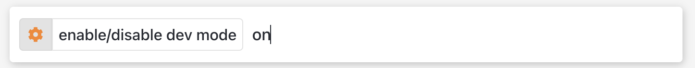
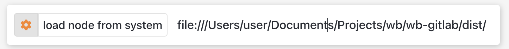
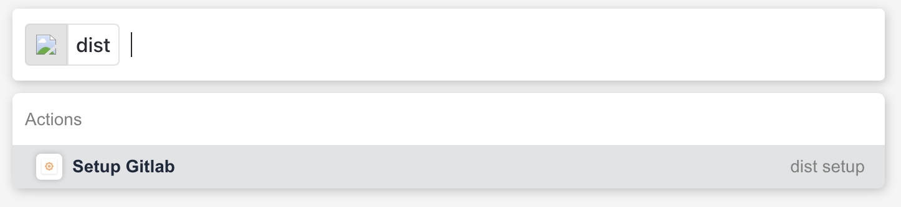
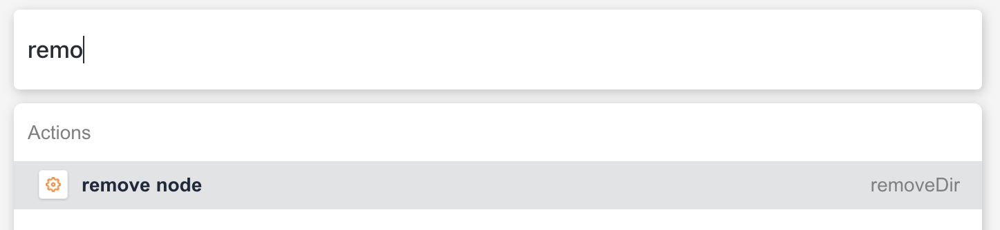
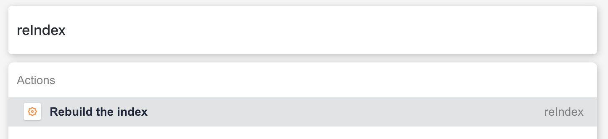

<h1 align="center">wb-gitlab</h1>
<h3 align="center"><a href="https://workerb.io/">workerB</a> package for <a href="https://gitlab.com/">Gitlab</a></h3>

# Demo

  

## How to install:

- Create account on [workerb](https://workerb.io/).
- Install [workerb extension](https://chrome.google.com/webstore/detail/jdbakbjkiklbibfccegfejjdlcgpnnpe).
- Add Gitlab package.
- Setup Gitlab package.
- 🚀🚀

**MAIN URI** : `https://gitlab.example.com/api/v4`

## Development

-   To install project dependencies, run `yarn install`.
-   To build the project, run `yarn build` (_production build_).
-   To continuously build the project, run `yarn watch` (_but this will not build new files and folders that you create while developing the project_).
-   Run `yarn build` or `yarn watch` in terminal
-   Log into https://workerb.app.
-   Press `Ctrl + k` to open workerB action bar.
-   Run `dev on` in the workerB action bar.

-   Hit Enter to stat the dev mode (_notification will come on top right corner indicating dev mode is on_)
-   Run `loadDir <path>` in the workerB action bar. `path` is the path of the dist folder generated by yarn.
-   For path of your dist folder append `file:///` in the start _in case of windows_

-   After successfully loading your dist location scripts you can start using workerB

-   To remove the dist folder and script use `removeDir` command (_notification will come on top right corner indicating taht script is removed_)

-   Hit enter to remove the dist scripts
-   To re index whole scripts again (_used in case of loading new content from APIs or see the logs_) type `reIndex` in workerB action bar.

-   Hit Enter to re index.

## Support

- [Forums](http://forums.workerb.io/)
